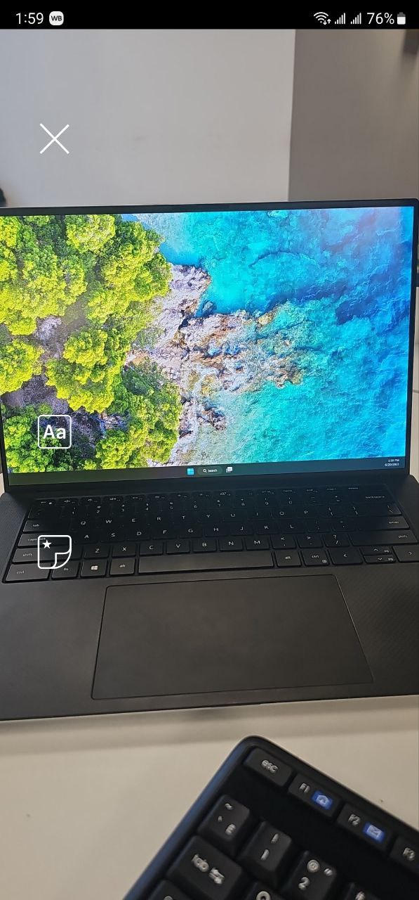
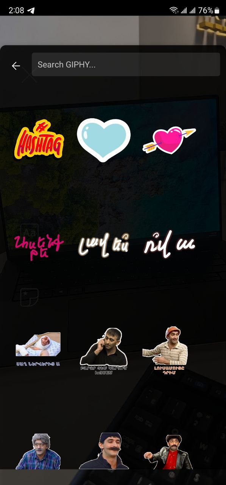
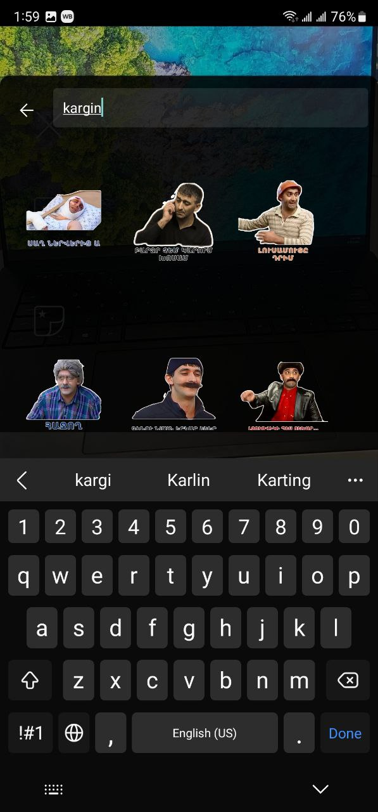
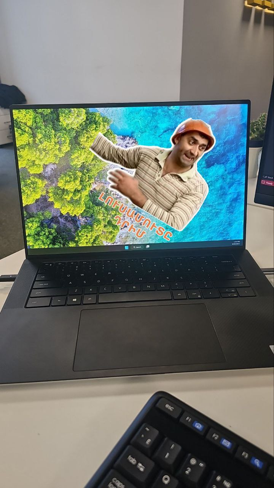

# Getting Started 

This is an example of how you may give instructions on setting up your project locally. To get a local copy up and running follow these simple example steps.

## Installation

1.Clone the repo

git clone https://github.com/MiqayelGalstyan/CameraApp.git

2.Install packages

npm install

### npm run android/ios

Runs the app in the development mode.\

You will see the app on your simulator/emulator

## Usage

Please grant your permission to the camera.

1. After the permission is granted, capture the photo.

2. Two icons can be seen on the left side of your screen. 

3. After taking photo, please press on the stickers icon where you will find all the available stickers. 

4. To find a sticker, type one of the following keywords: "kargin", "hi", "ok", "barev", "armenian". 

5. After choosing the sticker, you can resize,rotate and scale the sticker/stickers.

6. Press on the save button the save the resulted image in your photos.

7. The image is successfully saved in your phone.

## The project structure is organized as follows:

- /android: Contains the Android-specific code and resources.
- /ios: Contains the iOS-specific code and resources.
- assets: Contains the images/icons.
- /src: Contains the main source code for your React Native app.
- /src/layout: Contains  main Layout.
- /src/shared: Contains reusable components/helpers/models.
- /src/components: Contains application components.
- /src/utils: Contains utility functions and helpers.